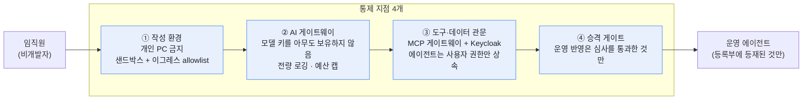
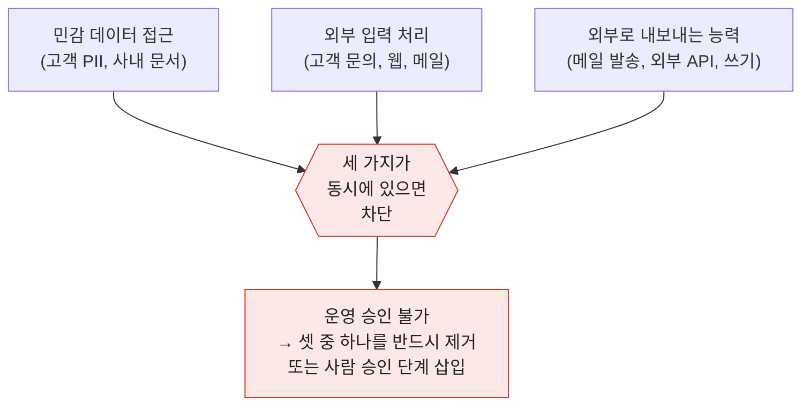
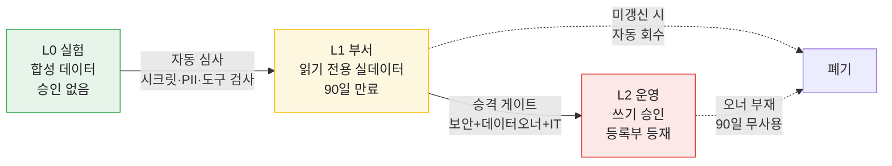
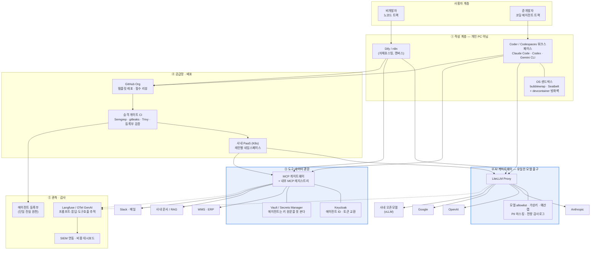
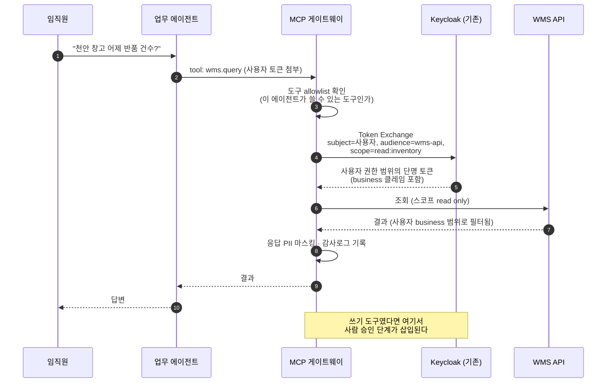
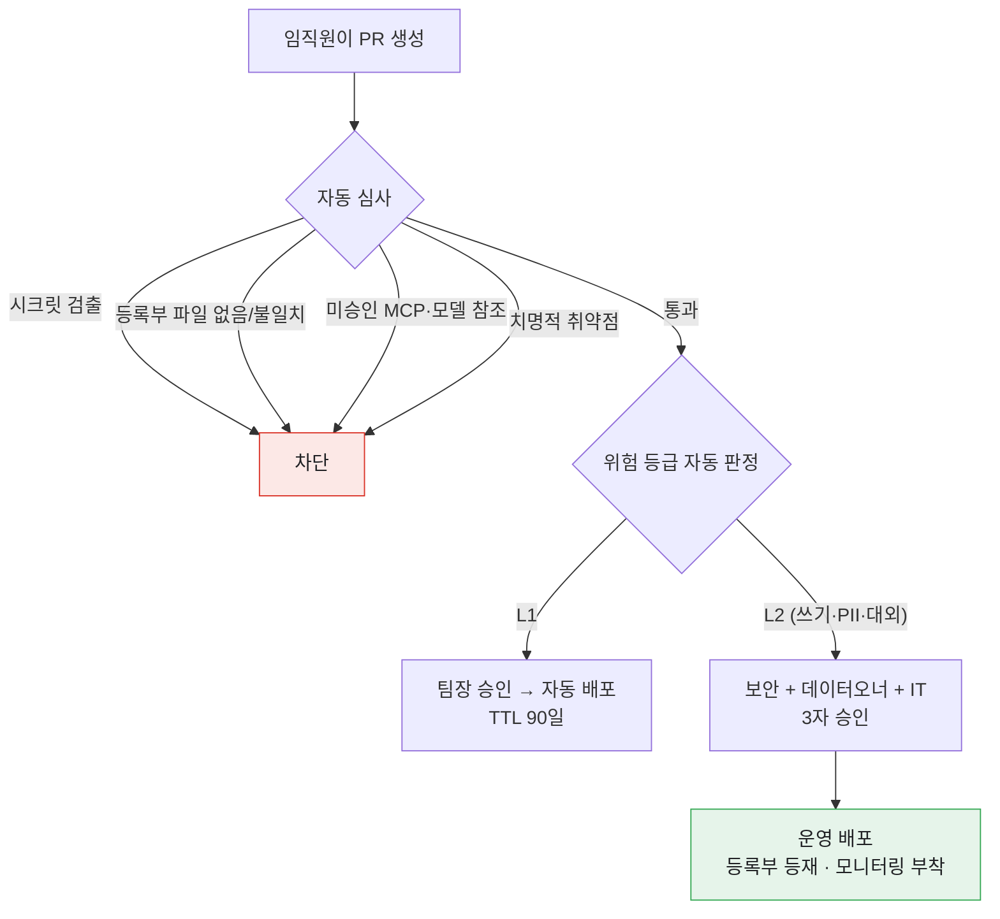
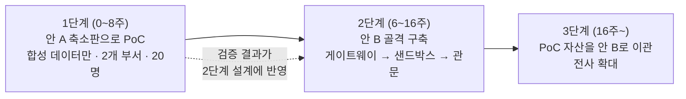
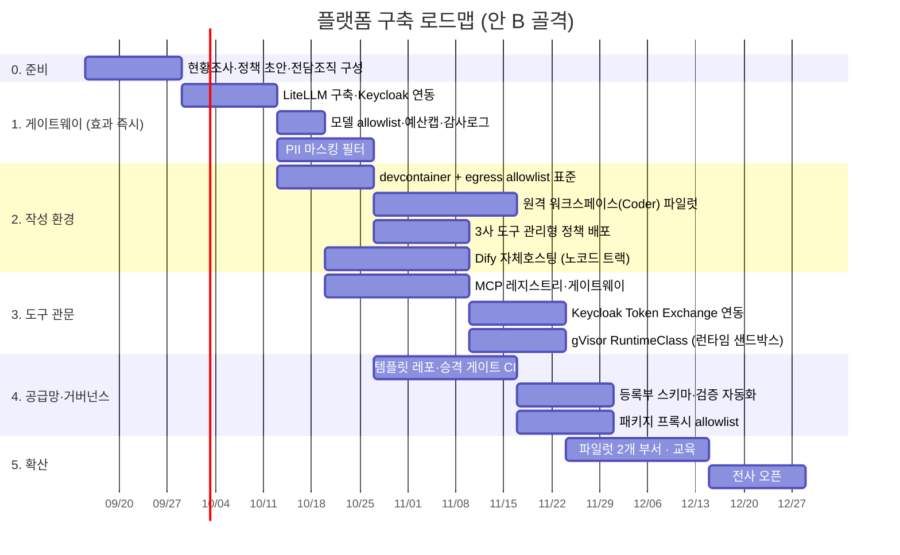

# 비개발자 임직원용 업무 에이전트 개발 플랫폼 구축 제안

임직원(비개발자)이 Claude / GPT / Gemini로 업무용 에이전트를 직접 만들되,
회사가 **샌드박스 · 보안 · 거버넌스**를 강제할 수 있는 환경에 대한 기술 제안서다.

| 항목 | 내용 |
|---|---|
| 작성일 | 2026-09-07 |
| 대상 | 사내 IT/보안 담당, AI 도입 TF |
| 범위 | 아키텍처 · 솔루션 선정 · 도입 로드맵 · 운영 프로세스 |
| 전제 | 사내 IdP로 **Keycloak** 운영 중 (`auth.returnit.co.kr`, realm `itgrims`) — 이 자산을 재활용하는 설계다 |
| 발표자료 | [`proposal-deck.pdf`](proposal-deck.pdf) — **외부 제공용** 16장 슬라이드. 고객사 고유정보를 전부 익명화했고, **온보딩 전략**과 **작업·준비 사항**이 들어간다 (소스: [`deck/`](deck/)) |
| 부록 | [`reference/`](reference/) — 그대로 적용 가능한 설정 파일 5종 |

---

## 0. 결론 먼저

**"바이브코딩 통제 솔루션"이라는 단일 제품은 없다.** 시장을 뒤져도 나오지 않는다.
시장에 있는 것은 두 종류인데, 둘 다 문제의 절반씩만 다룬다.

| 제품군 | 예 | 다루는 범위 | 다루지 못하는 것 |
|---|---|---|---|
| **개발 도구 관리** | Claude Code managed settings, Codex `requirements.toml`, GitHub Copilot 정책 | 임직원이 **코드를 만드는 순간** | 만들어진 에이전트가 사내 DB를 무단으로 조회하는 것 |
| **에이전트 런타임 거버넌스** | Microsoft Agent 365, AWS Bedrock AgentCore, Gemini Enterprise | 배포된 에이전트가 **돌아가는 순간** | 임직원 노트북에서 API 키가 새는 것 |

사고는 대부분 **후자, 즉 런타임에서** 발생한다. 그런데 많은 조직이 전자만 도입해 놓고 통제를 끝냈다고 여긴다.

### 제안의 골자

플랫폼 하나를 구매하는 것이 아니라, **통제 지점(choke point) 4개**를 만들고 그 외에는 자유를 준다.
이 네 곳만 반드시 거치게 만들면 임직원이 어떤 도구로 무엇을 만들든 통제가 가능해진다.



| 통제 지점 | 핵심 솔루션 (권고) | 예방하는 사고 |
|---|---|---|
| ① 작성 환경 | 원격 개발환경 + OS 샌드박스 + 도메인 allowlist | 소스/데이터가 개인 PC·외부로 나감, 무단 스크립트 실행 |
| ② AI 게이트웨이 | **LiteLLM Proxy 자체호스팅** | API 키 유출과 사적 사용, 비용 폭주, 금지 모델 사용, 기록 없는 프롬프트 |
| ③ 도구·데이터 관문 | **MCP 게이트웨이 + 기존 Keycloak** | 과잉 권한, 프롬프트 인젝션으로 인한 도구 오남용, PII 유출 |
| ④ 승격 게이트 | GitHub 필수 리뷰 + SAST/시크릿/SCA + 에이전트 등록부 | 미검증 코드의 운영 반영, 유령 에이전트, 규제 대응 불가 |

**핵심 원칙: 비개발자에게 "만들 자유"는 최대한 열어 주되, "권한"은 일절 주지 않는다.**
권한은 사람이 아니라 **승인된 에이전트에게, 실행 시점에, 그 사용자의 범위만큼** 빌려준다.

---

## 1. 통제 대상을 정확히 정의한다

"비개발자 바이브코딩"에서 실제로 발생하는 위험은 6가지다. 솔루션 선정은 이 6개를 각각
어느 지점이 막아 주는지를 기준으로 판단해야 한다.

| # | 위험 | 구체적 시나리오 | 막는 지점 |
|---|---|---|---|
| R1 | **데이터 유출** | 반품 CS 에이전트를 만들다 고객 주소·연락처가 담긴 CSV를 그대로 외부 모델에 붙여넣음 | ①② |
| R2 | **자격증명 확산** | 동작시키려고 받은 운영 DB 계정을 코드에 하드코딩, 개인 노트북과 Slack에 잔존 | ①③ |
| R3 | **과잉 권한** | "조회만" 만들려던 에이전트가 WMS 쓰기 권한까지 가진 계정으로 붙어 있음 | ③ |
| R4 | **프롬프트 인젝션** | 고객 문의 본문에 심어진 지시를 에이전트가 따라 환불 API를 호출 | ③ |
| R5 | **공급망** | 모델이 지어낸, 실재하지 않는 패키지를 설치 → 동명의 악성 패키지가 선점되어 있음 | ①④ |
| R6 | **유령 에이전트 / 비용** | 만든 사람이 부서를 옮긴 뒤, 아무도 모르는 채 6개월간 가동되며 매달 과금 | ②④ |

### 위험 R4는 기술로 100% 막을 수 없다

프롬프트 인젝션은 현재 완전 방어 수단이 없다. 그래서 **구조로** 막아야 한다.
한 에이전트가 아래 세 가지를 동시에 갖추고 있으면 그 에이전트는 언제든 뚫린다고 봐야 한다.



이 판정은 **자동화할 수 있다.** 에이전트 등록부([`reference/agent-registry.schema.json`](reference/agent-registry.schema.json))에
선언된 데이터 등급·입력원·도구 목록으로 CI에서 기계적으로 판정하면 된다. 사람 심사에 의존하면 반드시 뚫린다.

---

## 2. 3-레인 모델 — 통제 강도를 등급으로 나눈다

전부 똑같이 통제하면 아무도 쓰지 않는다. 반대로 전부 풀면 사고가 난다.
**데이터 등급으로 레인을 나누고, 레인을 넘을 때만 심사한다.**

| | **L0 · 실험 레인** | **L1 · 부서 레인** | **L2 · 운영 레인** |
|---|---|---|---|
| 누가 | 전 임직원 | 교육 이수자 | 승격 심사를 통과한 것 |
| 데이터 | 합성/마스킹만. 실데이터 반입 **금지** | 실데이터 **읽기 전용**, PII 마스킹을 거친 것 | 실데이터 (범위 승인) |
| 사용자 | 본인만 | 소속 부서 (~50명) | 전사 / 대외 |
| 쓰기 권한 | 없음 | 없음 | 승인된 API만, 건별 한도 |
| 네트워크 | 모델 엔드포인트 + 승인 도메인만 | 동일 + 사내 읽기 API | 명시 allowlist |
| 승인 | 없음 (즉시 시작) | 팀장 1인 | 보안 + 데이터 오너 + IT |
| 배포 | 개인 워크스페이스 | 사내 PaaS, 자동 만료 90일 | 정식 배포, SLA/모니터링 |
| 심사 | 없음 | 자동 심사만 | 자동 심사 + 사람 심사 |
| 목표 리드타임 | **0일** | **1일 이내** | 2주 이내 |



> **L0의 리드타임 0일이 이 설계의 핵심이다.** 실험 단계에 승인을 걸면 임직원은
> 개인 ChatGPT 계정으로 이탈한다(= 통제 불가능한 섀도 AI). L0을 충분히 쓸 만한 수준으로
> 갖춰 두는 것이 가장 효과적인 보안 대책이다.

---

## 3. 레퍼런스 아키텍처



### 실행 시점의 권한 흐름 — "에이전트는 자기 권한이 없다"

가장 중요한 설계다. 에이전트에게 고정 계정을 주면 R3(과잉 권한)·R4(인젝션)가 즉시 성립한다.
**요청한 사람의 토큰을 교환해서, 그 사람이 원래 볼 수 있는 범위만** 열어준다.
기존 Keycloak의 Token Exchange로 그대로 구현된다.



이 구조의 효과:

- 에이전트가 인젝션에 당해도 **요청자가 원래 못 보는 데이터는 못 본다.** 피해 상한이 사용자 권한으로 고정된다.
- 이미 운영 중인 `business` 클레임(ITGRIMS/CHEONAN 분리)이 그대로 에이전트에도 적용된다. **별도 권한 체계를 새로 만들 필요가 없다.**
- 퇴사자 계정 비활성화 → 그 사람이 만든 에이전트도 즉시 무력화. 유령 에이전트 문제의 절반이 자동 해결된다.

---

## 4. 계층별 솔루션 선정

### 4.1 작성 계층 — 두 개의 트랙으로 나눈다

"비개발자"를 한 덩어리로 보면 실패한다. 실제로는 두 부류이고 필요한 도구가 다르다.

| | **노코드 트랙** | **코딩 에이전트 트랙** |
|---|---|---|
| 대상 | 현업 대다수 (CS, 물류운영, 영업, 인사) | 스프레드시트 매크로/SQL 정도는 하는 층 |
| 만드는 것 | 정형 워크플로 (문의 분류→요약→티켓 생성) | 비정형 로직, 사내 API 조합, 데이터 가공 |
| 도구 | **Dify** (권고) / n8n / Flowise | **Claude Code · OpenAI Codex · Gemini CLI** |
| 통제 방식 | 플랫폼 자체 RBAC + 노드 allowlist | 관리형 정책 파일 + OS 샌드박스 |
| 산출물 | 플랫폼 내 앱 (코드 아님) | Git 레포 (코드) |
| 비중 예상 | 인원의 80% | 인원의 20%, 가치의 60% |

**노코드 트랙 권고: Dify 자체호스팅.**
RBAC·SSO·감사로그가 기본 탑재라 별도 조립이 필요 없고, 자체호스팅이라 데이터가 사내에 남는다.
n8n은 범용 자동화가 강해 사내 시스템 연동이 많으면 유리하지만 AI 앱 UX는 Dify가 낫다.
둘 다 쓰는 것도 무리는 아니다 — 단, **모델 호출은 반드시 ②게이트웨이를 거치게** 설정한다(둘 다 OpenAI 호환 base URL 지정 가능).

**코딩 에이전트 트랙 권고: 3사 모두 허용하되 정책은 하나로.**
임직원이 GPT/Claude/Gemini를 고르게 하는 것이 요청사항이므로 도구를 묶지 않는다.
대신 **모든 도구가 같은 게이트웨이와 같은 샌드박스를 통과**하게 만든다. 각 도구의 관리형 정책 기능:

| 도구 | 관리 정책 수단 | 강제 가능한 것 |
|---|---|---|
| **Claude Code** | `managed-settings.json` (`/etc/claude-code/`, MDM, 또는 claude.ai 서버 관리 설정) | 권한 deny 규칙, `disableBypassPermissionsMode`, `allowedMcpServers` + `allowManagedMcpServersOnly`, `sandbox.network.allowedDomains` + `allowManagedDomainsOnly`, `availableModels`, `forceLoginOrgUUID` |
| **OpenAI Codex** | `requirements.toml` (클라우드/디바이스 채널 배포) | 권한 프로필, 샌드박스 강제, 승인 모드, 커넥터/플러그인 통제, RBAC, Compliance API |
| **Gemini CLI / Code Assist** | 엔터프라이즈 정책 + VPC-SC | 모델·리전 제한, 도구 제한, 데이터 경계 |

> Claude Code 관리형 설정은 사용자·프로젝트·로컬 설정과 `--settings`를 모두 덮어쓰며,
> 더 **엄격한** 하위 값만 예외적으로 인정된다. 즉 임직원이 정책을 느슨하게 풀 수 없다.
> 예시 파일: [`reference/managed-settings.json`](reference/managed-settings.json)

### 4.2 샌드박스 — "개발 시점"과 "런타임"을 분리해서 본다

가장 자주 혼동되는 지점이다. **둘은 다른 문제이고 다른 도구를 쓴다.**

#### (A) 개발 시점 샌드박스 — 임직원이 코드를 만드는 동안

| 방식 | 격리 범위 | 비용/난이도 | 권고 |
|---|---|---|---|
| 도구 내장 Bash 샌드박스 (`/sandbox`) | Bash 명령만. **파일 도구·MCP·훅은 호스트에서 그대로 실행됨** | 매우 낮음 | 단독으로는 **불충분** |
| sandbox-runtime 래핑 | 프로세스 전체 (도구·MCP·훅 포함) | 낮음 | 개인 PC 허용 시 최소선 |
| **devcontainer + default-deny iptables** | 개발환경 전체 | 중 | **표준으로 채택 권고** |
| 원격 워크스페이스 (Coder / Codespaces) | 전체, 개인 PC에 소스 미존재 | 중 | **L1 이상 필수** |
| 전용 VM / microVM (Firecracker) | 커널까지 분리 | 높음 | 외부 코드 취급 시 |

**권고: 개인 PC 에서의 작성을 정책적으로 금지하고, 원격 워크스페이스를 표준으로 한다.**
소스와 데이터가 애초에 개인 장비에 내려가지 않으면 R1·R2의 상당 부분이 구조적으로 소멸한다.
Coder(자체호스팅, K8s 위)가 비용·통제 면에서 가장 무난하고, GitHub Codespaces는 도입이 빠르다.

**이그레스(egress) allowlist가 샌드박스의 본체다.** 파일 격리보다 이쪽이 중요하다.
컨테이너에서 기본 차단 후 아래만 연다 — 이것 하나로 "데이터를 외부로 보내는" 경로 대부분이 닫힌다.

```
허용:  AI 게이트웨이(사내) · 패키지 프록시(사내) · Git 서버(사내/GitHub Org) · MCP 게이트웨이(사내)
차단:  그 외 전부 (모델 벤더 API 직결 포함 — 반드시 게이트웨이 경유)
```

#### (B) 런타임 샌드박스 — 만들어진 에이전트가 코드를 실행할 때

에이전트가 사용자 요청에 따라 파이썬을 생성·실행하는 유형(데이터 분석, 리포트)은
**모델이 만든 코드를 그대로 돌리는 것**이므로 개발 시점보다 격리 요구가 높다.

| 옵션 | 격리 | 콜드스타트 | 자체호스팅 | 비고 |
|---|---|---|---|---|
| Docker + seccomp | 커널 공유 | 빠름 | O | 최소선. 커널 취약점에 노출 |
| **gVisor (runsc)** | 유저스페이스 커널 | 빠름 | O | 기존 K8s에 RuntimeClass로 추가 가능 — **권고** |
| **Firecracker microVM** | 전용 커널 | ~150ms | O | 최고 수준. 운영 부담 있음 |
| E2B (관리형) | Firecracker | 빠름 | X (SaaS) | 빠른 도입용. 코드가 외부로 나감 |
| Daytona (관리형) | 컨테이너 | 매우 빠름 | 일부 | 격리 강도는 microVM 대비 낮음 |

**권고: 기존 K8s에 gVisor RuntimeClass를 추가**해 코드 실행 에이전트를 그 위에서만 돌린다.
클러스터를 새로 만들 필요가 없고, PII를 다루는 워크로드가 외부 SaaS로 나가지 않는다.
초기 PoC는 E2B로 빠르게 검증한 뒤 자체호스팅으로 이관하는 경로도 합리적이다.

### 4.3 AI 게이트웨이 — 가장 먼저, 가장 확실하게 효과가 나는 지점

**여기서부터 시작할 것을 강력히 권고한다.** 구축 2주, 효과 즉시.

원칙: **임직원도, 에이전트도, 어떤 코드도 벤더 API 키를 갖지 않는다.**
모두 사내 게이트웨이의 가상 키(virtual key)만 받고, 실제 벤더 키는 게이트웨이에만 존재한다.

| 후보 | 성격 | 판단 |
|---|---|---|
| **LiteLLM Proxy** | 오픈소스, 자체호스팅 | **권고.** 100+ 모델 통합, 가상키/예산/팀 단위 관리, 콜백으로 관측 연동. RBAC·감사로그 등 일부는 상용 티어 |
| Portkey | SaaS 중심 (2026년 Palo Alto Networks 인수) | 가드레일·프롬프트 관리까지 한 제품으로 원할 때. 자체호스팅 옵션 제한적 |
| Kong AI Gateway | 기존 Kong 사용 시 | 이미 Kong을 쓰고 있다면 자연스러움 |
| Cloudflare AI Gateway | 매니지드, 도입 최단 | 로그가 외부에 남는 점 검토 필요 |

게이트웨이에서 강제할 항목 (설정 예시: [`reference/litellm-gateway.yaml`](reference/litellm-gateway.yaml)):

1. **모델 allowlist** — 승인된 모델·리전만. 학습에 데이터가 쓰이지 않는 기업 계약 엔드포인트만 등록
2. **가상 키 = Keycloak 사용자/팀 매핑** — 누가 무엇을 얼마나 썼는지 사람 단위로 추적
3. **예산 캡** — 사용자·팀·에이전트별 월 한도. 초과 시 자동 차단 (R6 비용 폭주 방지)
4. **입출력 필터** — PII 탐지·마스킹(Presidio 등), 프롬프트 인젝션 패턴 탐지, 유해 출력 차단
5. **전량 감사 로그** — 프롬프트·응답·모델·비용·호출자. 마스킹 후 보관, SIEM 전송
6. **레인별 정책 분리** — L0 키는 사내 API 접근 불가, L2 키만 운영 데이터 스코프 허용

> 부수 효과: 3사 모델을 OpenAI 호환 인터페이스 하나로 통일하므로,
> 임직원이 만든 에이전트가 **모델 벤더에 종속되지 않는다.** 모델 교체가 설정 한 줄이 된다.

### 4.4 아이덴티티 — 새로 사지 말고 Keycloak을 쓴다

이미 realm `itgrims`와 `business` 클레임 체계가 운영 중이다. 여기에 얹으면 된다.
상세 설계: [`reference/keycloak-agent-identity.md`](reference/keycloak-agent-identity.md)

| 필요 | Keycloak 구현 |
|---|---|
| 에이전트마다 고유 신원 | 에이전트당 client 1개 (`agent-<slug>`), 등록부와 1:1 |
| 에이전트가 사용자 권한을 상속 | **Token Exchange** (subject=사용자 토큰 → audience=대상 API, scope 축소) |
| 에이전트별 접근 범위 제한 | client scope + audience 매퍼. 기존 `business` 클레임 그대로 전파 |
| 사람 없는 배치 에이전트 | service account + 최소 role, 단 **L2 승인 필수** |
| 퇴사/이동 시 즉시 차단 | 사용자 비활성화가 곧 에이전트 무력화 |
| 자격증명 보관 | Keycloak은 신원만. 비밀값은 **Vault / AWS Secrets Manager**, 에이전트는 원문 미열람 |

**금지 사항으로 못 박을 것: 에이전트에게 개인 계정, 공용 계정, 장기 API 키를 주지 않는다.**
이 원칙 하나가 R2·R3의 근본 원인을 제거한다.

### 4.5 도구·MCP 게이트웨이 — 에이전트가 "할 수 있는 일"의 목록

에이전트의 실제 위험은 모델이 아니라 **연결된 도구**에서 나온다. 도구를 개별 에이전트가
자유롭게 붙이게 두면 통제가 성립하지 않는다.

**구조: 내부 MCP 레지스트리(무엇이 존재하는가) + MCP 게이트웨이(누가 무엇을 호출하는가).**

- **레지스트리**: 승인된 MCP 서버 목록. 각 항목에 소유팀, 데이터 등급, 읽기/쓰기 구분, 보안 검토일 기록.
  임직원은 이 카탈로그에서만 고른다. 외부 MCP 서버 임의 연결은 `allowedMcpServers` + `allowManagedMcpServersOnly`로 차단
- **게이트웨이**: 에이전트별 도구 allowlist 강제, Keycloak 토큰 교환, 호출 전량 로깅, 레이트 리밋,
  **쓰기 도구는 사람 승인 큐로** (환불·발송·삭제·대외 발신)
- **도구 등급**: `read` / `write` / `external-send` 3분류. `external-send`를 가진 에이전트는 자동으로 L2 심사 대상

> 쓰기 도구에 사람 승인을 넣는 것이 번거로워 보이지만, 이것이 R4(프롬프트 인젝션)에 대한
> **유일하게 확실한 방어**다. 승인 없이 쓰기를 허용할 에이전트는 입력원이 전부 신뢰 가능한 것뿐이어야 한다.

### 4.6 공급망 · 배포 — 정해진 길(paved road) 하나만 만든다

비개발자에게 선택지를 주면 안 된다. **템플릿 하나, 파이프라인 하나.**

| 통제 | 수단 | 막는 것 |
|---|---|---|
| 시작점 고정 | GitHub 템플릿 레포 (샌드박스 설정·CI·등록부 파일 내장) | 제각각 구성 |
| 코드 검사 | Semgrep / CodeQL (SAST) | 취약 코드의 운영 반영 |
| 시크릿 검사 | gitleaks + GitHub secret scanning + push protection | R2 자격증명 커밋 |
| 의존성 | Trivy / OSV-Scanner + SBOM | 취약 패키지 |
| **패키지 프록시** | Artifactory / Nexus / Verdaccio (allowlist) | **R5 환각 패키지 설치** — 사내 프록시에 없는 패키지는 애초에 설치 불가 |
| 리뷰 | 브랜치 보호 + CODEOWNERS 필수 승인 | 무심사 배포 |
| 배포 | Argo CD → 레인별 네임스페이스, L1은 TTL 90일 | 유령 에이전트 |

승격 게이트 워크플로 예시: [`reference/promotion-gate.yml`](reference/promotion-gate.yml)



### 4.7 관측 · 감사 — 규제 대응의 실체

| 목적 | 수단 |
|---|---|
| 에이전트 동작 추적 | **Langfuse**(자체호스팅) 또는 OpenTelemetry GenAI 시맨틱 컨벤션 |
| 무엇이 기록되어야 하나 | 프롬프트·응답(마스킹)·모델·도구 호출·토큰·비용·호출자·에이전트 ID |
| 보안 이벤트 | 게이트웨이 로그 → SIEM. 이상 패턴(대량 조회, 비정상 시간대, 신규 도메인) 알림 |
| 비용 | 게이트웨이 예산 대시보드. **에이전트별 단가**를 오너에게 매월 통보 |
| 규제 | 등록부 + 감사로그가 **AI 기본법 대응의 근거자료**가 된다 (아래 6.3) |

---

## 5. 도입안 3가지 비교

| | **안 A · SaaS 최속** | **안 B · 자체호스팅 하이브리드** | **안 C · 단일 클라우드 통합** |
|---|---|---|---|
| 구성 | Claude/ChatGPT Enterprise + GitHub + Portkey/Cloudflare GW + E2B | 원격 워크스페이스 + LiteLLM + Dify + MCP GW + Keycloak + K8s(gVisor) | Bedrock AgentCore 또는 Gemini Enterprise 또는 Foundry/Agent365 |
| 기간 | 4~6주 | **10~14주** | 8~12주 |
| 초기 비용 | 낮음 | 중 | 중 |
| 운영 인력 | 0.5명 | **1.5~2명** | 1명 |
| 데이터 위치 | 상당수 외부 | **전량 사내** | 해당 클라우드 |
| 모델 3사 자유 | 제한적 | **완전 자유** | 제한적 (자사 우선) |
| 락인 | 벤더별 분산 | 낮음 | **높음** |
| 기존 Keycloak 활용 | 부분 | **완전** | 부분 (IdP 연동만) |
| 적합 | 3개월 내 성과 증명이 급할 때 | **PII 취급 + 3사 병행 + 장기 운영** | 이미 특정 클라우드에 전면 투자한 경우 |

### 권고: 안 B (자체호스팅 하이브리드), 단 안 A로 8주 먼저 검증

요청 조건이 **"GPT·클로드·제미나이를 임직원이 골라 쓴다"**이므로 안 C는 구조적으로 맞지 않는다
(각 클라우드의 에이전트 플랫폼은 자사 모델에 최적화되어 있고 타사 모델 지원은 부차적이다).

안 A를 바로 전면 도입하면 **고객 PII가 여러 SaaS로 분산**되어 나중에 되돌리기 어렵다.
그래서 순서를 이렇게 권고한다.



1단계에서 **실데이터를 절대 넣지 않는 것**이 조건이다. 이걸 지키면 PoC는 순수한 학습이 되고,
지키지 않으면 PoC가 그대로 되돌릴 수 없는 부채가 된다.

---

## 6. 거버넌스 (기술이 아닌 부분)

기술만으로는 통제가 안 된다. 아래 3가지가 없으면 위 아키텍처는 반년 안에 우회당한다.

### 6.1 에이전트 등록부 (Agent Registry) — 단일 진실 원천

**모든 에이전트는 레포 안의 `agent.yaml`로 자기 자신을 선언하고, CI가 이를 검증한다.**
선언이 없거나 실제 코드와 불일치하면 배포가 차단된다. 사람이 관리하는 엑셀 대장은 반드시 실패한다.

스키마: [`reference/agent-registry.schema.json`](reference/agent-registry.schema.json)

| 필드 | 왜 필요한가 |
|---|---|
| `owner`, `backup_owner` | 유령 에이전트 방지. 오너 퇴사 시 자동 알림 |
| `lane` (L0/L1/L2) | 적용할 정책 결정 |
| `data_classes` | PII 포함 여부 → 심사 강도 |
| `input_sources` | 외부 입력(고객 문의 등) 여부 → 인젝션 위험 판정 |
| `tools[].kind` (read/write/external-send) | **3요소 동시 보유 자동 판정** (1장의 도표) |
| `models[]` | 승인 모델인지 검증 |
| `review_due` | 만료. 미갱신 시 자동 비활성 |
| `human_in_loop` | 쓰기 승인 필요 여부 |

### 6.2 사람과 프로세스

| 항목 | 내용 |
|---|---|
| **AI 사용 정책 개정** | "개인 계정으로 사내 데이터를 외부 AI에 입력 금지"를 명문화. 대신 L0를 즉시 제공 |
| **교육/자격 제도** | L1 이상 접근은 2~3시간 교육 이수 후. 내용: 데이터 등급, 인젝션, 시크릿, 등록부 작성법 |
| **에이전트 오너십** | 기술 담당자가 아니라 **업무 담당 부서**가 오너. IT는 플랫폼 오너 |
| **분기 감사** | 등록부 vs 실제 배포 대조, 90일 무사용 자동 회수, 비용 상위 10개 재검토 |
| **전담 조직** | 플랫폼팀 1.5~2명 + 보안 검토 0.5명. **없으면 착수하지 말 것** |

### 6.3 규제 대응 (AI 기본법 · 개인정보보호법)

「인공지능 발전과 신뢰 기반 조성 등에 관한 기본법」이 **2026년 1월 22일 시행**되었다.
사내 업무용 에이전트도 적용 대상이 될 수 있으며, 위 아키텍처가 산출물 그대로 근거자료가 된다.

| 법상 요구 | 이 아키텍처에서 대응하는 것 |
|---|---|
| 투명성 (생성물 표시·사전 고지) | 에이전트 응답 템플릿에 AI 생성 고지 삽입 — 등록부에서 강제 |
| 안전성 확보·위험관리 | 3-레인 + 승격 게이트 + 도구 등급 |
| 기록 보관·설명 의무 | 게이트웨이 전량 감사 로그 + Langfuse 추적 |
| 고영향 AI 판단 | 등록부의 `data_classes` / `use_case`로 후보 식별 → 법무 검토로 확정 |
| 개인정보 처리 | 게이트웨이 PII 마스킹 + 레인별 데이터 등급 + 처리 위탁 검토 |

> **고영향 AI 해당 여부는 법무·컴플라이언스 확인이 필요하다.** 채용/인사, 신용평가 등에 쓰이면
> 해당될 소지가 크므로, 그런 용도는 L2 심사에서 별도 법무 승인 항목으로 분리할 것을 권한다.
> 이 문서는 기술 제안이며 법률 자문이 아니다.

---

## 7. 12주 로드맵



**순서가 중요하다.** 게이트웨이(②)를 가장 먼저 세운다 — 2주 만에 "누가 무엇을 얼마나 쓰는지"
가시성이 확보되고, 이후 모든 통제의 기반이 된다. 샌드박스나 노코드 플랫폼을 먼저 하면
게이트웨이 도입 시 전부 재설정해야 한다.

---

## 8. 흔히 실패하는 지점

실제로 이런 프로젝트가 무너지는 이유는 기술이 아니라 아래다.

| 실패 패턴 | 결과 | 대응 |
|---|---|---|
| **통제를 먼저, 편의는 나중에** | 임직원이 개인 계정으로 이탈 → 통제 불가능한 섀도 AI. 도입 전보다 상황이 나빠진다 | L0를 즉시·무승인으로 제공. 승인은 데이터가 개입할 때만 |
| **PoC에 실데이터 투입** | 되돌릴 수 없는 부채, 규제 노출 | 1단계는 합성 데이터만. 예외 없음 |
| **플랫폼 하나로 다 되는 제품 탐색** | 6개월간 벤더만 비교하다 아무것도 착수하지 못함 | 초크포인트 4개 각각 최선의 도구. 게이트웨이부터 2주 만에 시작 |
| **전담 인력 없이 착수** | 6개월 뒤 방치된다 | 플랫폼팀 1.5~2명 확보가 전제조건 |
| **비개발자에게 코드 리뷰 요구** | 병목, 우회 | 사람 리뷰 대신 **자동 심사 + 레인 제한**. 사람은 L2만 |
| **만든 뒤 방치** | 유령 에이전트, 비용 누수 | `review_due` 만료 자동 비활성 + 분기 감사 |
| **에이전트에 고정 계정 부여** | 과잉 권한 + 인젝션 피해 확대 | Token Exchange로 사용자 권한 상속 (4.4) |

---

## 9. 즉시 결정이 필요한 사항

제안을 구체화하려면 아래가 정해져야 한다.

1. **대상 규모** — 1차 오픈 인원과 부서 (20명/2개 부서 파일럿을 권고)
2. **데이터 등급 기준** — 반품/배송 데이터 중 어디까지가 PII 이고 어디까지 L1에서 읽기 허용인지
3. **인프라 방향** — 기존 K8s 재활용 가능 여부, 클라우드/온프렘 구성
4. **전담 인력** — 플랫폼팀 1.5~2명 확보 가능 여부 (**가장 중요**)
5. **모델 계약** — 3사 기업 계약 여부 (학습 미사용·데이터 보존 조건 확인 필요)
6. **규제 범위** — 채용/인사/평가 용도 에이전트를 허용할 것인지 (고영향 AI 소지)

---

## 부록 — 바로 적용 가능한 설정

| 파일 | 용도 |
|---|---|
| [`reference/managed-settings.json`](reference/managed-settings.json) | Claude Code 전사 강제 정책 (MDM/파일 배포) |
| [`reference/litellm-gateway.yaml`](reference/litellm-gateway.yaml) | AI 게이트웨이 정책 (모델 allowlist·예산·레인 분리) |
| [`reference/keycloak-agent-identity.md`](reference/keycloak-agent-identity.md) | 기존 Keycloak으로 에이전트 신원·권한 상속 구성 |
| [`reference/agent-registry.schema.json`](reference/agent-registry.schema.json) | 에이전트 등록부 스키마 + 위험 자동 판정 규칙 |
| [`reference/promotion-gate.yml`](reference/promotion-gate.yml) | 승격 게이트 CI 워크플로 |
| [`proposal-deck.pdf`](proposal-deck.pdf) | 외부 제공용 발표자료 16장 — 익명화 완료 (빌드: [`deck/`](deck/)) |

---

## 참고 자료

**1차 문서 (제품 사양 확인)**

- [Claude Code — Choose a sandbox environment](https://code.claude.com/docs/en/sandbox-environments)
- [Claude Code — Deploy managed settings](https://code.claude.com/docs/en/managed-settings)
- [OpenAI Codex — Enterprise admin setup](https://learn.chatgpt.com/docs/enterprise/admin-setup)

**시장 현황 (2026)**

- [LLM Gateway Guide 2026 — LangWatch](https://langwatch.ai/blog/best-llm-gateways-in-2026)
- [AI gateway comparison 2026 — Braintrust](https://www.braintrust.dev/articles/ai-gateway-comparison-2026)
- [AI Agent Sandboxing in 2026: Docker, E2B, Firecracker, gVisor, Modal & Daytona](https://amux.io/guides/ai-agent-sandboxing/)
- [Daytona vs E2B in 2026 — Northflank](https://northflank.com/blog/daytona-vs-e2b-ai-code-execution-sandboxes)
- [MCP governance in the enterprise, early 2026 — DX Heroes](https://dxheroes.io/insights/mcp-governance-landscape-early-2026)
- [Best MCP Gateways, Runtimes & Registries — Arcade.dev](https://www.arcade.dev/blog/mcp-gateways-runtimes-registries-guide/)
- [Enterprise AI Agent Platforms 2026 비교](https://wetheflywheel.com/en/guides/enterprise-ai-agent-platforms-2026/)
- [Open Source AI Agent Platform Comparison 2026 — n8n, Dify, LangGraph](https://jimmysong.io/blog/open-source-ai-agent-workflow-comparison/)
- [Vibe Coding and the AI Security Governance Gap — ISACA](https://www.isaca.org/resources/news-and-trends/isaca-now-blog/2026/vibe-coding-and-the-ai-security-governance-gap)
- [Enterprise Vibe Coding: Governance & Security Guide 2026 — RTS Labs](https://rtslabs.com/enterprise-vibe-coding/)

**규제**

- [AI 기본법 시행과 그 시사점 — 법률신문](https://www.lawtimes.co.kr/news/articleView.html?idxno=216500)
- [AI 기본법 톺아보기 — SK AX](https://www.skax.co.kr/insight/trend/3666)

> 시장 현황 항목은 벤더 중립 검증을 거치지 않은 2차 자료다. 최종 솔루션 선정 전에
> 후보 2~3개를 사내 환경에서 직접 PoC 하여 확인할 것을 권한다.
