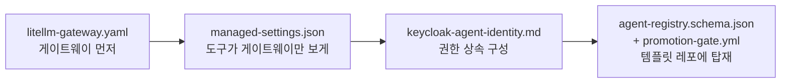

# 부록 — 바로 적용 가능한 설정

[제안서 본문](../README.md)에서 참조하는 설정 파일이다.
**그대로 붙여넣지 말고**, 사내 도메인·조직 UUID·모델명·스코프를 채워 넣은 뒤
스테이징에서 검증하고 적용할 것.

| 파일 | 대응 통제 지점 | 내용 |
|---|---|---|
| [`managed-settings.json`](managed-settings.json) | ① 작성 환경 | Claude Code 전사 강제 정책. `/etc/claude-code/managed-settings.json` 또는 MDM으로 배포. 개인 설정·`--settings`로 덮어쓸 수 없다 |
| [`litellm-gateway.yaml`](litellm-gateway.yaml) | ② AI 게이트웨이 | 모델 allowlist, 리전 고정, PII 마스킹, 레인별 예산 캡, 전량 감사 로그 |
| [`keycloak-agent-identity.md`](keycloak-agent-identity.md) | ③ 도구·데이터 관문 | 기존 realm `itgrims`로 에이전트 신원 구성 + Token Exchange로 사용자 권한 상속 |
| [`agent-registry.schema.json`](agent-registry.schema.json) | ④ 승격 게이트 | 에이전트 등록부 스키마. 치명적 조합(PII + 신뢰불가 입력 + 외부 발신) 자동 판정 규칙 포함 |
| [`promotion-gate.yml`](promotion-gate.yml) | ④ 승격 게이트 | GitHub Actions 승격 심사. 등록부 검증 → 시크릿 → SAST → 공급망 → 배포 |

## 적용 순서



게이트웨이를 먼저 세워야 한다. `managed-settings.json`의 `ANTHROPIC_BASE_URL`과
`sandbox.network.allowedDomains`가 게이트웨이 주소를 가리키기 때문이다.

## 벤더 키를 배포하지 않는 방법

`managed-settings.json`에는 API 키를 넣지 않는다. `apiKeyHelper`가 가리키는 스크립트
(`/opt/itgrims/bin/gateway-key.sh`)가 **로그인한 사용자의 Keycloak 토큰으로 게이트웨이에서
가상 키를 받아 stdout으로 출력**한다. 키는 파일에 남지 않고, 사용자가 비활성화되면 즉시 무효가 된다.

```bash
#!/usr/bin/env bash
# gateway-key.sh — 사용자별 단명 가상키 발급 (개요)
set -euo pipefail
TOKEN=$(kc-login --realm itgrims --print-access-token)   # 기존 SSO 세션 재사용
curl -fsS -H "Authorization: Bearer $TOKEN" \
     https://ai-gw.internal.itgrims.co.kr/key/ephemeral | jq -r .key
```

Codex와 Gemini CLI도 같은 원리로 base URL과 키 획득 경로를 게이트웨이로 고정한다.

## 검증 안 된 부분

검증하지 못한 항목은 그대로 밝혀 둔다. 적용 전 사내 환경에서 확인이 필요하다.

- **Keycloak Token Exchange** — 26.x는 표준 토큰 교환과 레거시 내부 교환이 별개 기능이고
  버전별로 지원 상태·설정 위치가 다르다. 빈 인스턴스에서 먼저 재현할 것
  (`../../keycloak-verification/`과 같은 방식)
- **LiteLLM 가드레일 스키마** — 버전에 따라 키 이름이 바뀐다. 설치 버전 문서와 대조 필요
- **Presidio 한국어 PII** — 주민등록번호·한국 주소 인식은 커스텀 recognizer가 필요하다.
  기본 설정으로는 한국어 PII 탐지율이 낮다
- **각 도구의 관리형 정책 키** — Claude Code 키는 공식 문서로 확인했으나,
  Codex `requirements.toml`과 Gemini CLI 정책은 실제 배포로 검증하지 않았다
