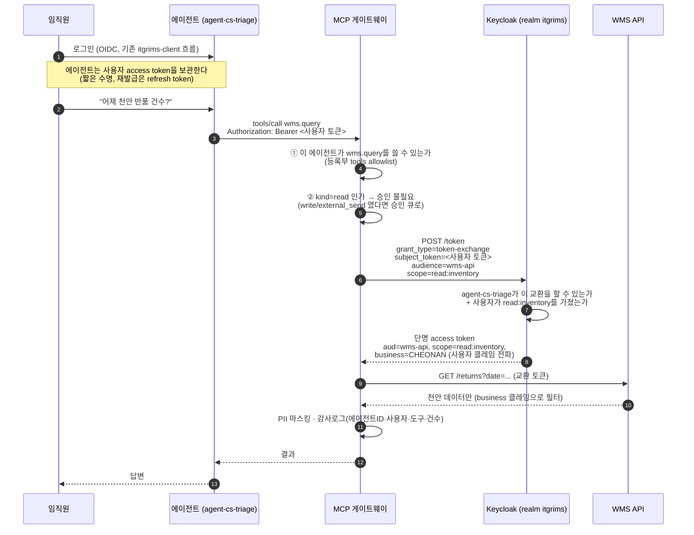

# 기존 Keycloak으로 에이전트 신원·권한 구성

새 IAM 제품을 도입하지 않는다. 이미 운영 중인 realm `itgrims`에 얹는다.

> **검증 필요**: 이 문서는 설계안이다. 아래 절차는 사내 Keycloak(26.4.7 확인됨)에서
> 실제로 재현해 본 뒤 확정해야 한다. 특히 Token Exchange는 Keycloak 버전에 따라
> 지원 상태와 설정 위치가 다르다(표준 토큰 교환 / 레거시 내부 교환이 별개 기능이다).
> `kcconsoleguide-revised.md` 검증 때와 같은 방식으로 빈 인스턴스에서 먼저 재현할 것.

---

## 1. 왜 이 설계인가

에이전트에 고정 계정(서비스 계정 + 장기 시크릿)을 주면 두 가지가 동시에 성립한다.

- **과잉 권한**: "조회만 하는 봇"이라며 만든 계정이 실제로는 그 API의 전 범위를 갖는다.
- **인젝션 피해 확대**: 프롬프트 인젝션에 당하면 그 계정 권한 **전부**가 공격자 손에 들어간다.

대신 **요청한 사람의 토큰을 교환**해서 그 사람 권한만큼만 빌려주면, 인젝션에 당해도
피해 상한이 "그 사용자가 원래 볼 수 있던 것"으로 고정된다.

부수 효과가 크다 — 이미 운영 중인 `business` 클레임(ITGRIMS / CHEONAN 분리)이
**에이전트에도 자동으로 그대로 적용된다.** 천안 담당자가 쓰는 에이전트는 천안 데이터만 본다.
에이전트용 권한 체계를 새로 설계할 필요가 없다.

---

## 2. 구성 요소 매핑

| 개념 | Keycloak 객체 | 명명 규칙 |
|---|---|---|
| 에이전트 1개 | client 1개 | `agent-<slug>` — 등록부 `id`와 동일 |
| 에이전트가 호출할 사내 API | client (bearer-only 성격) | `wms-api`, `docs-api` … |
| 에이전트가 가질 수 있는 권한 | client scope | `read:inventory`, `write:refund` … |
| 도구 등급 | scope 접두어 | `read:*` / `write:*` / `send:*` |
| 사람 없는 배치 에이전트 | service account | **L2 승인 필수**, 최소 role |
| 비밀값(DB 접속정보 등) | Keycloak 아님 | **Vault / Secrets Manager**. 에이전트는 원문 미열람 |

**client는 사람이 만들지 않는다.** 승격 게이트 CI의 `sync_keycloak_client.py`가
`agent.yaml`의 `tools[].scope`를 읽어 재생성한다. 코드가 선언보다 넓은 권한을 쓰려 해도
토큰에 스코프가 없어 API에서 거부된다. **선언과 실권한이 구조적으로 일치한다.**

---

## 3. 토큰 흐름



핵심은 4~5단계다. **에이전트는 자기 권한으로 API를 부르지 않는다.**
사용자 토큰을 재료로 더 좁은 토큰을 발급받아 쓴다. 축소만 가능하고 확대는 불가능하다.

---

## 4. 설정 절차 (초안 — 검증 후 확정)

### 4-1. 사내 API를 audience로 등록

1. Clients → Create client → `wms-api`
2. Client authentication **On**, Standard flow **Off** (직접 로그인하지 않는다)
3. Client scopes → `wms-api-dedicated` → Mappers → **Audience** 매퍼 추가
   - Included Client Audience: `wms-api`
4. 필요한 scope를 client scope로 생성: `read:inventory`, `write:refund` …
   - 각각 **Optional**로 붙인다 (요청 시에만 토큰에 실림 = 최소권한)

### 4-2. `business` 클레임 전파 확인

기존 `itgrims-client`에 붙어 있는 User Attribute 매퍼(`business`)와 **동일한 매퍼**를
`agent-*` client와 `wms-api` 쪽에도 만들어야 교환 토큰에 클레임이 실린다.
`kcconsoleguide-revised.md` 3단계와 같은 설정이다.

> 교환 후 토큰에 `business`가 실제로 실리는지 반드시 확인할 것.
> 매퍼가 빠지면 API 쪽 필터가 무력화되어 **천안 담당자가 본사 데이터를 보게 된다.**
> 검증은 `steps/05-verify-token.sh`와 같은 방식으로 토큰을 디코드해 확인한다.

### 4-3. 에이전트 client 생성 (CI가 수행)

1. Clients → Create client → `agent-cs-triage`
2. Client authentication **On** (confidential), 시크릿은 Vault로만
3. **Standard token exchange** 활성화
   - Keycloak 26.x는 표준 토큰 교환(RFC 8693)을 클라이언트별 토글로 제공한다.
   - 레거시 내부 교환과 별개 기능이며, 서버 기동 옵션/기능 플래그가 필요할 수 있다.
   - **현재 사내 버전에서 어느 쪽이 켜져 있는지 먼저 확인할 것.**
4. Client scopes에 이 에이전트가 쓸 scope만 Optional로 부착
   - `agent.yaml`의 `tools[].scope`와 정확히 일치해야 한다 (CI가 대조)

### 4-4. 교환 요청 형식

```bash
curl -X POST "$KC/realms/itgrims/protocol/openid-connect/token" \
  -d "grant_type=urn:ietf:params:oauth:grant-type:token-exchange" \
  -d "client_id=agent-cs-triage" \
  -d "client_secret=$AGENT_SECRET" \
  -d "subject_token=$USER_ACCESS_TOKEN" \
  -d "subject_token_type=urn:ietf:params:oauth:token-type:access_token" \
  -d "audience=wms-api" \
  -d "scope=read:inventory"
```

응답 토큰을 디코드해 아래 4가지를 확인한다.

```
aud       = wms-api          (다른 API에는 못 쓴다)
scope     = read:inventory   (요청한 것만. 쓰기 없음)
business  = CHEONAN          (사용자 클레임 전파됨)
exp       = 짧게             (5~15분 권장)
```

---

## 5. 반드시 지킬 규칙

| 규칙 | 이유 |
|---|---|
| 에이전트에 **개인 계정·공용 계정** 부여 금지 | 감사 추적 불가, 퇴사 시 고아 |
| **장기 API 키** 발급 금지 | 유출 시 무기한 유효 |
| service account는 **L2 승인 + 최소 role** | 사용자 권한 상속이 불가능한 경우의 예외 |
| 교환 토큰 수명 **15분 이하** | 유출 창 최소화 |
| scope는 **Optional**로만 부착 | Default로 두면 항상 실려서 최소권한이 깨진다 |
| API 쪽에서 **audience + scope를 반드시 검증** | 토큰만 발급하고 API가 검증 안 하면 전부 무의미 |
| 시크릿은 **Vault**, 코드·환경파일에 두지 않음 | R2 자격증명 확산 |
| 사용자 비활성화 = 에이전트 무력화가 되는지 **정기 확인** | 유령 에이전트 방지의 핵심 |

---

## 6. 감사 시 확인할 것 (분기)

1. `agent-*` client 목록 vs 에이전트 등록부 — **불일치 = 미등록 에이전트 또는 고아 client**
2. 각 client의 scope vs `agent.yaml` 선언 — 콘솔에서 수동으로 넓힌 흔적
3. service account를 쓰는 에이전트 전수 — L2 승인 이력이 있는가
4. 토큰 교환 실패 로그 급증 — 선언보다 넓은 권한을 쓰려는 코드가 있다는 신호
5. 90일 미사용 client 비활성화
