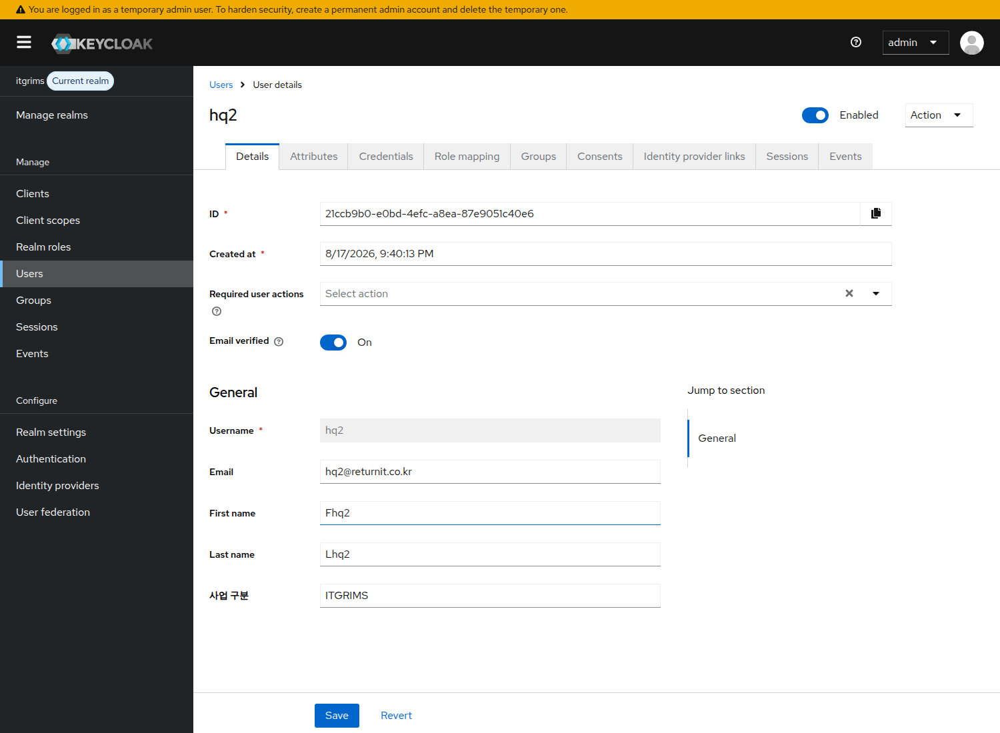
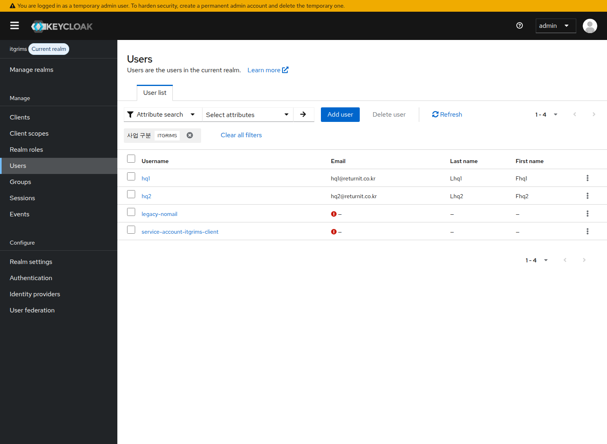
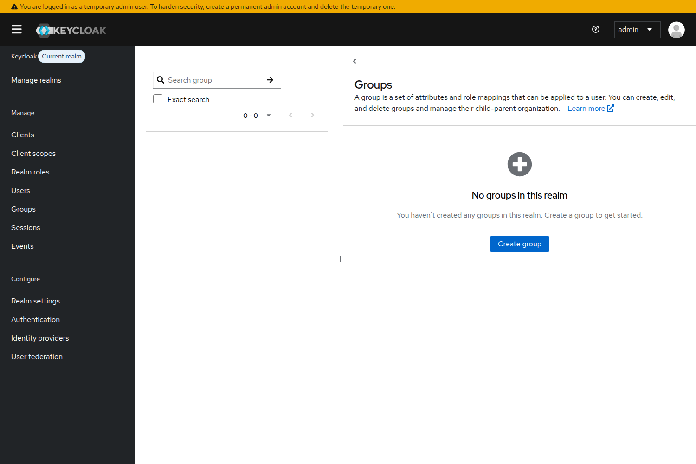

# Keycloak 콘솔 작업 가이드 검증 결과

`kcconsoleguide.pdf` (WMS-136 · 천안분리 A-1 · business 클레임 설정) 의 절차를
**빈 Keycloak 인스턴스**에서 처음부터 끝까지 재현하고, 가이드가 주장하는 내용을 하나씩 검증했다.

| 항목 | 값 |
|---|---|
| 검증 대상 | Keycloak **26.4.7** (`quay.io/keycloak/keycloak:26.4`, `start-dev`) |
| 검증일 | 2026-08-17 |
| 방법 | ① 콘솔이 호출하는 것과 동일한 Admin REST 로 전 단계 수행 + assert (`verify.sh`) <br> ② 실제 admin console 을 Chromium 으로 조작해 화면/라벨 확인 (`console-checks.mjs`) |
| 결과 | REST 검증 **23/23 PASS**, 콘솔 화면 검증 **33/33 PASS**, 수정본 가이드 콘솔 e2e **30/30 PASS** |

**수정본 가이드: [`kcconsoleguide-revised.md`](kcconsoleguide-revised.md)** — 아래 지적을 모두 반영한 판이며,
빈 Keycloak 에서 그 문서대로 콘솔을 클릭해 전 단계를 수행하는 e2e(`console-run.mjs`)로 다시 검증했다(30/30 PASS).

**결론: 절차 자체는 동작한다.** 1~6단계를 그대로 밟으면 `business` 클레임이 액세스 토큰에
문자열로 실리고, 기존 계정의 비밀번호 로그인도 깨지지 않는다.
다만 **4단계와 6단계는 이 버전의 콘솔에서 글자 그대로 따라 할 수 없거나 결과가 어긋난다.**
아래 3건은 작업 전에 고쳐야 한다.

---

## 1. 반드시 고쳐야 할 것

### (A) 4단계 — "Attributes 탭" 이 없다  ★가장 먼저 막히는 지점

가이드: *Users → 계정 선택 → **Attributes 탭**에서 business = ITGRIMS 를 넣고 Save*

실제 26.4 사용자 상세 탭은 `Details / Credentials / Role mapping / Groups / Consents /
Identity provider links / Sessions / Events` 뿐이고 **Attributes 탭이 없다.**
Realm settings → General → **Unmanaged attributes** 가 기본값 `Disabled` 이면 이 탭은 나오지 않는다
(`ENABLED` 로 바꾸면 탭이 나타나는 것까지 확인).

2단계에서 `business` 를 User Profile 에 선언했으므로, 값은 **Details 탭의 폼 필드**로 노출된다.
필드 라벨은 속성명 `business` 가 아니라 2단계에서 넣은 **Display name = `사업 구분`** 이다.

> 수정안: *Users → 계정 선택 → **Details 탭 맨 아래 `사업 구분` 필드**에 ITGRIMS/CHEONAN 입력 → Save*
> (Attributes 탭을 찾겠다고 Unmanaged attributes 를 켜지 말 것. realm 전체 동작이 바뀐다.)



### (B) 6단계 — "두 건수의 합 = 전체 사용자 수" 는 성립하지 않는다

서비스 계정은 **Users 목록에는 안 나오지만 Attribute search 결과에는 나온다.** 확인한 수치:

```
Attribute search  business=ITGRIMS → 4건 (service-account-itgrims-client 포함)
Attribute search  business=CHEONAN → 1건
합 5건        vs   Users 목록 총계 4건        →  합이 총계보다 1 크다
```

즉 4단계 지시대로 서비스 계정에도 값을 넣으면 **합 > 총계**가 되어, 가이드의 판정 기준대로면
"뭔가 잘못됐다"고 읽히고, 반대로 합을 맞추려고 서비스 계정을 빼면 그 계정이 enforce 후 403 이 된다.

> 수정안: *합계 = (Users 목록 총계) + (서비스 계정 수)* 로 판정.
> 서비스 계정은 Users 메뉴로는 도달할 수 없으므로 **Clients → 각 클라이언트 → Service accounts roles 탭**
> 에서 계정을 열어 값을 넣고, 개수를 따로 세어 더할 것.



### (C) 0단계 — URL 해시는 realm 을 보장하지 않는다

이미 콘솔이 열려 있는 탭에 `.../console/#/itgrims/groups` 를 붙여넣으면 **주소창은 itgrims 인데
콘솔은 이전 realm(master) 그대로**다. Groups 화면이 "No groups in this realm" 으로 뜨는데,
이 상태에서 그룹을 만들면 정확히 가이드가 경고한 "master 에 만드는 사고"가 난다.
**새로고침(F5) 후에야** realm 이 전환되는 것을 확인했다.

또한 26.4 에는 "좌측 상단 realm 드롭다운"이 없다. 좌측 상단에는 **realm 이름 + `Current realm` 배지**,
그 아래 `Manage realms` 메뉴가 있다.

> 수정안: *URL 을 붙여넣었으면 반드시 새로고침하고, 해시가 아니라 **좌측 상단 `Current realm` 배지가
> itgrims 인지**로 확인할 것.*



---

## 2. 문구를 정확히 해야 할 것

| 가이드 서술 | 실제 확인 결과 |
|---|---|
| 2단계: "Required field 를 On 으로 두면 이 속성이 없는 기존 계정이 `Account is not fully set up` 으로 로그인 실패" | **가이드가 지정한 설정(Who can edit = Admin 만)에서는 On 으로 둬도 로그인이 깨지지 않는다.** 사용자가 편집할 수 없는 속성은 VerifyProfile 이 요구하지 않기 때문. `edit` 에 `user` 가 포함될 때만 실제로 로그인이 깨진다 (재현 확인). 결론적으로 "Off 로 두라"는 지시는 그대로 두되, 경고 문구는 "권한을 user 까지 열면서 Required 를 켜면 깨진다"로 조건을 붙이는 게 정확하다. |
| 6단계: "키 `business`, 값 `ITGRIMS` 로 검색" | Attribute search 의 **Key 는 드롭다운**이고 항목이 **Display name(`사업 구분`)** 으로 표시된다. `business` 라는 문자열은 목록에 없다. 값 입력 후 오른쪽 **체크(✓) 버튼으로 확정**해야 Search 버튼이 활성화된다(그냥 Enter 로는 "Specify an attribute key" 오류). |
| 6단계: "per-page 를 최대로" | 선택지는 10/20/50/**100** per page. 계정이 100 을 넘으면 페이지를 넘겨야 한다. |
| 5단계: "User 칸에 계정명" | 실제 라벨은 **Users** (필수 항목), 타입어헤드 선택 방식. 비밀번호 없이 동작하는 건 가이드대로 확인. |
| 5단계: "서버는 `/business/CHEONAN` 같은 슬래시 문자열도 받아 정규화한다" | 서버 앱 동작은 이 저장소에 코드가 없어 확인 못 했다. 다만 **2단계의 options validator 때문에 그런 값은 애초에 저장이 거부된다**(HTTP 400 `error-invalid-value`). 가이드 안에서 서로 충돌하는 설명이므로 한 쪽을 지우는 게 좋다. |
| 시작 전에: "`kc.sh export` 로 백업" | 명령 자체는 맞고 credential 해시가 포함되는 것도 확인했다. 단 **서버가 붙어 있는 DB 를 배타적으로 잠그는 구성(내장 H2 등)에서는 서버를 내리기 전엔 실행되지 않는다**(`Database may be already in use`). prod 가 외부 Postgres 면 문제없다. |
| 문제 해결 표: "`Account is not fully set up` → 프로필 필수 필드 누락" | 원인이 하나 더 있다. **비밀번호를 Temporary=On 으로 설정하면**(`UPDATE_PASSWORD` 필수 액션) 같은 메시지가 나온다. 4단계에서 이미 Temporary 를 경고하고 있으니, 문제 해결 표에도 이 원인을 추가해야 증상만 보고 오진하지 않는다. |

---

## 3. 가이드가 맞았던 것 (재현 확인)

- **"왜 콘솔인가" 의 근거가 정확하다.** `{"attributes": ...}` 한 키만 PUT 하면
  `email`/`firstName`/`lastName` 이 **모두 null 로 지워지고**, 그 계정은 즉시
  `Account is not fully set up` 으로 로그인이 깨진다. 스크립트 경로를 피한 판단은 옳다.
- **Group Membership 매퍼를 쓰면 클레임이 배열**로 나간다: `"business": ["/business/CHEONAN"]`.
  User Attribute 매퍼라도 **Multivalued = On** 이면 똑같이 배열이 된다 (둘 다 재현).
- **클라이언트를 잘못 고르면 클레임 자체가 없다** (다른 클라이언트로 받은 토큰에 `business` 키 없음).
- **매퍼를 붙인 클라이언트에서는** Evaluate 결과·실제 비밀번호 로그인 토큰·client_credentials 토큰
  모두에 `"business": "ITGRIMS"|"CHEONAN"` 이 **문자열**로 실린다.
  2단계에서 Permission 을 Admin 전용으로 잠가도 매퍼 동작에는 영향이 없다.
- **options validator 가 오타를 저장 시점에 거부**한다 (`CHEONAM` → HTTP 400).
- **User Profile 선언 저장 직후에도 기존 계정 로그인은 정상**이다 (가이드가 시키는 즉시 확인은 유효).
- **백업 관련 3가지가 모두 사실이다.** Admin REST `get users` 응답에 credential 없음 /
  콘솔 Partial export 에 일반 사용자 없음·credential 없음 / `kc.sh export --users different_files`
  에는 `secretData`(해시+salt) 포함.
- 1단계 그룹 생성, 3단계 매퍼 필드명(User Attribute, Token Claim Name, Claim JSON Type,
  Add to ID token/access token/userinfo, Multivalued), 2단계 속성 필드명(Display name,
  Multivalued, Required field, Who can edit/view), 4단계 Groups 탭 `Join Group` —
  **화면 라벨이 모두 가이드와 일치**한다.

## 4. 이 저장소에서는 검증할 수 없는 항목

`pma-web` 저장소가 비어 있어(커밋 없음) 서버 앱 쪽 주장은 확인하지 못했다. 별도 확인 필요:

- `normalizeBusinessClaim` 의 `typeof value !== 'string'` 즉시 거부, 403 `BUSINESS_CLAIM_MISSING`
- 슬래시 문자열의 마지막 조각만 취해 대문자로 정규화하는 동작
- `.env.prod` 의 `KEY_CLOAK_CLIENT_ID` = `itgrims-client` 인지, enforce 플래그가 이미지에 구워지는지
- prod/staging 콘솔 URL, staging 비밀번호 리셋 이력

## 5. 수정본 가이드를 콘솔에서 그대로 수행한 재검증

`kcconsoleguide-revised.md` 의 0~6단계를 **admin console 에서 실제로 클릭해** 수행하고 결과를 확인했다
(`console-run.mjs`). 그룹 생성, User Profile 속성 선언(validator 포함), 전용 스코프 매퍼 생성,
계정별 값 선택과 그룹 가입, 서비스 계정 처리, Evaluate 확인, Attribute search 집계까지 전부 화면 조작이다.

```
0 단계 2/2 · 1 단계 1/1 · 2 단계 5/5 · 3 단계 4/4 · 4 단계 5/5 · 5 단계 8/8 · 6 단계 5/5
→ PASS 30 / FAIL 0
```

이 과정에서 **원본에는 없던 화면 차이 3건**을 추가로 찾아 수정본에 반영했다.

| # | 원본/1차 수정본 | 실제 화면 |
|---|---|---|
| 11 | 3단계 `Add mapper → By configuration` | 매퍼가 하나도 없는 전용 스코프에는 그 드롭다운이 없다. 빈 화면의 **`Configure a new mapper`** 버튼으로 들어간다 |
| 12 | 3단계 `User Attribute: business` (입력값처럼 서술) | 자유 입력이 아니라 **User Profile 선언 속성 드롭다운**. 2단계를 먼저 끝내야 목록에 나온다. `Claim JSON Type` 은 기본값이 이미 `String` |
| 13 | 4단계 "값을 넣고 Save" | 콘솔로 `options` validator 를 넣으면 `annotations.inputType=select` 가 자동으로 붙어 **`사업 구분` 이 드롭다운**이 된다. 콘솔 경로에서는 오타 자체가 불가능하고, 오타 차단(400)은 REST 경로에서 확인됨 |


## 6. 재현 방법

```bash
cd keycloak-verification
npm i playwright

# (1) 원본 가이드의 주장 검증 — REST (23 assert)
./verify.sh

# (2) 수정본 가이드를 콘솔에서 그대로 수행 (30 assert)
./setup-baseline.sh                                   # 빈 Keycloak + realm/client/users 만 준비
CHROME=$(which chromium) node console-run.mjs

# (3) 콘솔 화면/라벨 단독 검증 (33 assert) — (2) 실행 후 상태에서
CHROME=$(which chromium) node console-checks.mjs

docker rm -f kc-verify                                # 정리
```

| 파일 | 역할 |
|---|---|
| `kcconsoleguide-revised.md` | **수정본 가이드** (배포용) |
| `setup-baseline.sh` | 빈 Keycloak 에 작업 전 상태(realm/client/users)만 구성 |
| `console-run.mjs` | 수정본 가이드를 콘솔 UI 로 전 단계 수행 + 검증 |
| `verify.sh` | 원본 가이드의 주장과 반례를 REST 로 검증 |
| `console-checks.mjs` | 콘솔 화면 구성/라벨 검증 |
| `steps/` | **스텝별 수행 스크립트** (00~06 + 롤백 + run-all). 자세한 내용은 `steps/README.md` |

## 7. 스텝별 수행 스크립트

계정이 많아 콘솔 클릭이 비현실적이거나 상태를 기계적으로 확인해야 할 때를 위해 단계별 스크립트를
`steps/` 에 두었다. 콘솔과 동일한 REST 엔드포인트만 쓰고, 사용자 레코드는 GET 한 표현에
`attributes` 만 병합해 PUT 하므로 가이드가 경고한 필드 삭제 경로를 타지 않는다.

```bash
cd steps
./run-all.sh --csv accounts.csv            # 전체 dry-run (기본)
./run-all.sh --csv accounts.csv --apply    # 0~6 단계 실행
./99-rollback.sh --apply                   # 되돌리기
```

빈 Keycloak 26.4.7 에서 확인한 것: `run-all.sh --apply` 전 과정 통과(6단계 판정식 성립),
dry-run 실행 후 realm 무변경, 재실행 멱등, `--fill-remaining` 이 `CHEONAN` 을 덮지 않음,
04 실행 후 `email`/`firstName`/`lastName` 보존, 값 없는 계정 발생 시 06 이 종료코드 1,
롤백 후 원상복구.
