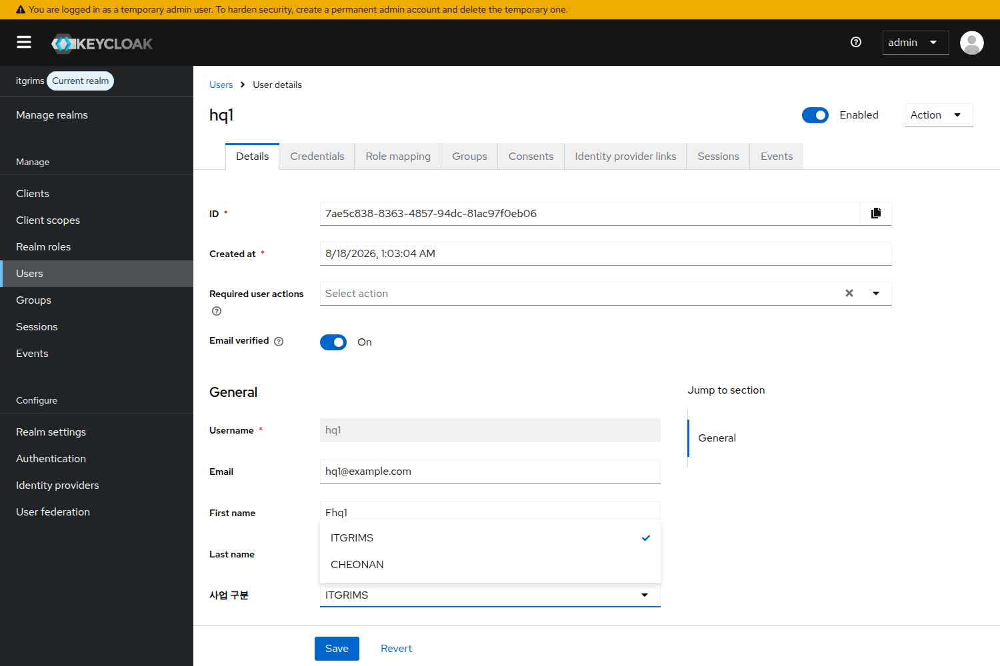

# Keycloak 콘솔 작업 가이드 (수정본)

**WMS-136 · 천안분리 A-1 · `business` 클레임 설정**

원본 `kcconsoleguide.pdf` 를 빈 Keycloak **26.4.7** 에서 전 단계 재현해 검증하고,
실제 화면과 어긋나던 부분을 고친 판이다. 변경 내역은 문서 끝 [부록 A](#부록-a--원본에서-바뀐-것) 참조.

CLI 스크립트 대신 웹 콘솔로 수행하는 절차다. staging 에서 비밀번호가 리셋된 이력이 있어,
사용자 레코드를 통째로 덮어쓰는 스크립트 경로를 피하고 콘솔에서 속성만 개별 편집한다.

| 항목 | 값 |
|---|---|
| prod 콘솔 | `auth.returnit.co.kr/admin/master/console/#/itgrims/groups` |
| staging 콘솔 | `auth-dev.returnit.co.kr/admin/master/console/#/itgrims/groups` |
| Realm | `itgrims` (master 아님) |
| 클라이언트 | `itgrims-client` |
| 클레임 | `business` = `ITGRIMS` \| `CHEONAN` |
| 검증된 버전 | Keycloak 26.4.7 (Unmanaged attributes = Disabled, 기본값) |

---

## 시작 전에

이 세 가지를 건너뛰면 되돌릴 수 없다.

### 0. 지금 보고 있는 realm 이 itgrims 인지 확인

Keycloak 콘솔 URL 은 `/admin/master/console/#/<관리대상-realm>/<메뉴>` 구조다.
앞의 `master` 는 콘솔 앱이 항상 붙는 고정 경로이고, 해시 뒤의 realm 이 편집 대상이다.

```
#/master/groups     ← master realm. 여기서 작업하면 아무 효과가 없다
#/itgrims/groups    ← 올바른 대상
```

**URL 만 보고 판단하지 말 것.** 이미 콘솔이 열려 있는 탭에 위 URL 을 붙여넣으면
주소창은 `#/itgrims/...` 로 바뀌지만 **콘솔은 직전 realm(master) 에 그대로 머문다.**
Groups 화면이 "No groups in this realm" 으로 비어 보이는데, 이 상태에서 그룹을 만들면
정확히 master 에 만들어진다. 붙여넣은 뒤에는 **반드시 새로고침(F5)** 한다.

확인은 주소창이 아니라 **좌측 상단의 realm 이름 + `Current realm` 배지**로 한다.
(26.4 에는 예전 같은 realm 드롭다운이 없다. realm 전환은 좌측 `Manage realms` 메뉴.)

매 단계 시작 전에 이 배지가 `itgrims` 인지 눈으로 확인한다.
master 는 Keycloak 관리자 계정이 있는 realm 이라, 실수로 만든 것이 있으면 정리해야 한다.

### 1. 자격증명 포함 백업

Admin REST 의 `get users` 는 비밀번호 해시를 반환하지 않는다. 그 파일로는 속성과 그룹만
복구되고 비밀번호는 못 살린다. 아래 둘 중 하나여야 한다.

```bash
# (A) Keycloak DB 스냅샷 — 가장 확실
pg_dump -h <kc-db-host> -U <user> -d keycloak > kc-prod-20260814.sql

# (B) realm export — users 파일에 credential 해시(secretData) 포함
kc.sh export --dir /tmp/kc-export --realm itgrims --users different_files
```

(B) 는 **DB 에 동시 접근이 가능한 구성에서만 서버를 띄운 채 실행된다.** 내장 H2 처럼 파일을
배타적으로 잠그는 구성이면 `Database may be already in use` 로 실패하므로 서버를 내리고 받아야 한다.
prod 의 외부 Postgres 구성이면 그대로 실행하면 된다.

콘솔의 `Realm settings → Action → Partial export` 는 **일반 사용자도 credential 도 포함하지 않는다**
(서비스 계정 레코드만 들어간다). 이 용도로 쓰면 안 된다.

### 2. 폐기용 계정으로 먼저 리허설

전 계정에 손대기 전에 테스트 계정 하나로 4단계와 5단계를 그대로 밟고 **같은 비밀번호로 재로그인**까지
확인한다. 여기서 로그인이 깨지면 즉시 중단하고, 원인을 잡기 전에는 나머지 계정을 건드리지 않는다.

---

## 왜 콘솔인가

스크립트의 `set_attr` 은 사용자 표현을 `{"attributes": ...}` 한 키로만 PUT 한다.
`email`, `firstName`, `lastName` 이 빠진 요청이라 **선언적 User Profile 이 켜진 상태에서는
그 세 값이 실제로 `null` 로 지워지고, 해당 계정은 즉시 `Account is not fully set up` 으로
로그인이 깨진다** (재현 확인). 콘솔의 사용자 편집 화면은 그 사용자의 폼 값 전체를 함께
보내므로 이 경로를 타지 않는다.

---

## 1단계 — 사업 그룹 만들기

좌측 메뉴 `Groups` → `Create group`

먼저 `business` 를 만들고, 그 안으로 들어가 `Create child group` 으로 두 개를 만든다.

| 경로 | 용도 |
|---|---|
| `/business` | 부모 그룹 (그릇 역할) |
| `/business/ITGRIMS` | 본사 |
| `/business/CHEONAN` | 천안스마트시티 |

그룹은 운영과 감사용 분류다. 토큰 클레임은 그룹이 아니라 사용자 속성에서 나온다(3단계 참조).

---

## 2단계 — User Profile 에 business 속성 선언

좌측 메뉴 `Realm settings` → `User profile` 탭 → `Create attribute`

| 필드 | 값 |
|---|---|
| Name | `business` |
| Display name | `사업 구분` |
| Multivalued | Off |
| Required field | **Off** |
| Permission — Who can edit? | Admin 만 체크 |
| Permission — Who can view? | Admin 만 체크 |
| Validations → `options` 추가 | 값 `ITGRIMS`, `CHEONAN` |

> **Display name 은 그대로 `사업 구분` 으로 둔다.** 4단계의 입력 필드 라벨과 6단계 Attribute search 의
> Key 목록에 이 이름이 그대로 쓰인다. 바꾸면 아래 화면 설명과 달라진다.

> **Required field 는 Off.** 이 값이 없는 기존 계정을 막지 않기 위해서다.
> (권한을 Admin 전용으로 잠근 상태에서는 On 으로 둬도 로그인이 바로 깨지지는 않는 것으로 확인됐다.
> 사용자가 편집할 수 없는 속성은 프로필 완성 검사 대상이 아니기 때문이다.
> 다만 나중에 `Who can edit` 에 `user` 를 추가하는 순간 값 없는 계정이 전부
> `Account is not fully set up` 이 된다. 값 채우기는 4단계에서 하고, 그 전까지는 Off 로 둔다.)

Validator 를 걸어두면 `CHEONAM` 같은 오타가 저장 시점에 `error-invalid-value` 로 거부된다.
`/business/ITGRIMS` 같은 슬래시 형태도 마찬가지로 거부되므로, 값은 항상 `ITGRIMS` / `CHEONAN` 만 넣는다.

> 콘솔에서 `options` validator 를 넣고 저장하면 Keycloak 이 속성에 `annotations.inputType = select` 를
> 자동으로 붙인다. 그 덕분에 **4단계의 입력 칸이 자유 입력이 아니라 두 값만 있는 드롭다운**으로 뜬다.
> (REST/import 로 선언하면 이 주석이 없어 텍스트 입력으로 뜨고, 오타는 Save 시점에 400 으로 걸린다.)

**저장 직후 확인.** 저장한 뒤 테스트 계정으로 즉시 로그인해 보고 정상이면 다음으로 넘어간다.
여기서 문제가 생기면 이후 단계는 무의미하다.

**`Unmanaged attributes` 는 건드리지 않는다.** (`Realm settings → General`) 기본값 `Disabled` 그대로 둔다.
켜면 realm 전체의 속성 처리 방식이 바뀐다. 4단계에서 "Attributes 탭이 안 보인다"는 이유로
이걸 켜는 일이 없도록 주의한다 — 아래 4단계는 탭 없이 진행하는 절차다.

---

## 3단계 — 클라이언트에 매퍼 추가

좌측 메뉴 `Clients` → `itgrims-client` → `Client scopes` 탭 → `itgrims-client-dedicated`
→ **매퍼가 하나도 없으면 화면 가운데 `Configure a new mapper` 버튼**
  (이미 매퍼가 있는 스코프라면 우측 상단 `Add mapper` → `By configuration`)
→ 목록에서 `User Attribute`

| 필드 | 값 |
|---|---|
| Name | `business-claim` |
| User Attribute | `business` |
| Token Claim Name | `business` |
| Claim JSON Type | `String` |
| Add to ID token | On |
| Add to access token | On |
| Add to userinfo | On |
| Multivalued | **Off** |

> `Client scopes` 는 좌측 메뉴에도 같은 이름이 있다. 여기서 쓰는 것은 **클라이언트 상세 화면 안의
> `Client scopes` 탭**이다.

> 매퍼 폼의 `User Attribute` 는 자유 입력이 아니라 **User Profile 에 선언된 속성 드롭다운**이다.
> 2단계를 먼저 끝내야 `business` 가 목록에 나온다. `Claim JSON Type` 은 기본값이 이미 `String` 이다.

**Group Membership 매퍼를 쓰면 전원 403.** 그쪽은 클레임을 배열로 내보낸다
(`"business": ["/business/CHEONAN"]` 로 나가는 것 확인). 서버의 `normalizeBusinessClaim` 이
`typeof value !== 'string'` 이면 즉시 거부한다. 반드시 User Attribute 매퍼여야 한다.
같은 이유로 **Multivalued 는 Off** 여야 한다. User Attribute 매퍼라도 On 이면 `["CHEONAN"]` 로 나간다.

**클라이언트 이름 주의.** 운영 스크립트의 usage 예시는 `mapper inventory-api` 지만 그건 로컬 개발
realm 기준이다. **prod 가 실제로 쓰는 클라이언트는 `itgrims-client`** 다 (`.env.prod` 의
`KEY_CLOAK_CLIENT_ID`). 예시대로 하면 엉뚱한 클라이언트에 붙어 클레임이 안 실린다
(매퍼 없는 클라이언트로 받은 토큰에는 `business` 키 자체가 없는 것 확인).

토큰을 발급받는 운영 클라이언트가 더 있다면 각각에 같은 매퍼를 추가해야 한다.
`Clients` 목록에서 전체를 확인한다.

---

## 4단계 — 계정별 속성과 그룹 배정

### 4-1. 일반 계정

좌측 메뉴 `Users` → 계정 선택 → **`Details` 탭**

`Details` 탭 아래쪽 `General` 영역의 **`사업 구분` 필드**(2단계에서 정한 Display name)에서
`ITGRIMS` 또는 `CHEONAN` 을 고르고 `Save`.

이 필드는 2단계의 `options` validator 때문에 **`Select an option` 드롭다운**으로 뜬다.
선택지가 두 개뿐이라 콘솔 경로에서는 오타가 아예 불가능하다.



> **`Attributes` 탭을 찾지 말 것.** `Unmanaged attributes = Disabled` (기본값) 인 realm 에는
> 사용자 상세에 `Attributes` 탭이 아예 없다. 탭 구성은
> `Details / Credentials / Role mapping / Groups / Consents / Identity provider links / Sessions / Events` 다.
> 2단계에서 선언한 덕분에 `business` 는 `Details` 탭의 정식 폼 필드로 노출된다.
> 탭을 만들겠다고 `Unmanaged attributes` 를 켜지 않는다.

이어서 같은 계정의 `Groups` 탭 → `Join Group` 으로 같은 값의 그룹에 가입시킨다.

### 4-2. 서비스 계정 (빠뜨리기 쉬움)

`service-account-...` 계정은 **`Users` 목록과 검색에 나오지 않는다.** 도달 경로는
`Clients` → 해당 클라이언트 → `Service accounts roles` 탭 → 상단의 사용자 링크다.
열리는 화면은 일반 사용자 상세와 같으므로 `Details` 탭의 `사업 구분` 에 값을 넣고 `Save`.

토큰을 발급받는 클라이언트마다 서비스 계정이 따로 있으므로 **클라이언트 수만큼 반복**한다.
여기서 넣은 서비스 계정 수는 6단계 계산에 쓰이니 **개수를 적어 둔다.**

### 주의

`Credentials` 탭은 열지 않는다. 이번 작업에 비밀번호 변경은 포함되지 않는다.
신규 계정을 만들어 비밀번호를 설정할 때는 `Temporary` 토글을 Off 로 둔다.
On 이면 `UPDATE_PASSWORD` 필수 액션이 붙어 최초 로그인에서 비밀번호 변경을 강요받고,
직접 인증(REST)에서는 `Account is not fully set up` 으로 실패해 "리셋된 것" 처럼 보인다.

한 명도 빠뜨리면 안 된다. enforce 전환 후 `business` 값이 없는 계정은 전부
403 `BUSINESS_CLAIM_MISSING` 이 된다. 본사 계정도 `ITGRIMS` 를 명시해야 한다. 비워두면 통과되지 않는다.

천안 계정을 먼저 `CHEONAN` 으로 배정한 뒤, 나머지 전부를 `ITGRIMS` 로 채우는 순서가 안전하다.
반대로 하면 천안 계정이 본사로 덮일 수 있다.

---

## 5단계 — 토큰에 클레임이 실리는지 검증

좌측 메뉴 `Clients` → `itgrims-client` → `Client scopes` 탭 → `Evaluate` 하위 탭

`Users` 칸(필수)에 계정명을 입력해 목록에서 고르고, 우측 `Generated access token` 을 누른다.
비밀번호가 필요 없다. 페이로드에 아래처럼 문자열로 실려야 한다.

```
"business": "CHEONAN"     ← 통과
"business": ["CHEONAN"]   ← 배열이면 403. 매퍼 종류 또는 Multivalued 설정이 틀린 것
(키 자체가 없음)           ← 매퍼 미적용 또는 클라이언트를 잘못 고른 것
```

본사 계정 1개와 천안 계정 1개를 각각 확인한다.
서비스 계정은 Evaluate 대신 실제 `client_credentials` 토큰으로 확인하는 편이 확실하다.

---

## 6단계 — 누락 계정 전수 확인

좌측 메뉴 `Users` → 검색창 왼쪽 드롭다운에서 `Attribute search` 선택 → `Select attributes`

- **Key 는 드롭다운에서 고른다.** 목록에는 속성명 `business` 가 아니라 **Display name `사업 구분`** 으로
  표시된다.
- Value 에 `ITGRIMS` 를 넣고 **오른쪽 체크(✓) 버튼으로 확정**한다. 확정 전에는 `Search` 가 비활성이고,
  그냥 Enter 를 치면 `Specify an attribute key` 오류가 난다.
- `Search` → 건수를 센다. `CHEONAN` 으로 한 번 더 반복한다.

### 판정식

```
(ITGRIMS 건수) + (CHEONAN 건수)  ==  (Users 목록 총계) + (4-2 에서 값을 넣은 서비스 계정 수)
```

**Attribute search 결과에는 서비스 계정이 포함되지만, `Users` 목록 총계에는 포함되지 않는다.**
그래서 단순히 "두 건수의 합 = 전체 사용자 수" 로 보면 서비스 계정 수만큼 항상 어긋난다.
좌변이 우변보다 작으면 그 차이가 실제 누락 계정이고, 그대로 enforce 하면 그 계정들이 403 이 된다.

전체 사용자 수는 `Users` 목록 기본 화면에서 확인한다. per-page 선택지는 10/20/50/**100** 이므로
계정이 100 을 넘으면 페이지를 넘겨 가며 세거나, 마지막 페이지 번호로 계산한다.

참고: 속성 검색의 값 비교는 대소문자를 구분하지 않는다(`itgrims` 로 검색해도 같은 건수).
누락을 놓치지 않으려면 값 자체는 항상 대문자로만 저장한다.

---

## 마무리 체크리스트

전부 체크된 뒤에야 enforce 로 넘어간다.

- [ ] 콘솔 좌측 상단 `Current realm` 배지가 `itgrims` (URL 해시만 믿지 않기, 붙여넣었으면 F5)
- [ ] 자격증명 포함 백업 확보 (DB 스냅샷 또는 realm export). REST `get users` 와 Partial export 는 해당 없음
- [ ] 폐기용 테스트 계정으로 2단계와 4단계 후 같은 비밀번호 재로그인 성공
- [ ] `/business/ITGRIMS`, `/business/CHEONAN` 그룹 존재
- [ ] User Profile 에 `business` 선언, Required field = Off, `options` 검증 적용, 권한 Admin 전용
- [ ] `Unmanaged attributes` 는 Disabled 그대로
- [ ] `itgrims-client` 에 User Attribute 매퍼 `business-claim` 추가 (Group Membership 아님, Multivalued Off)
- [ ] 토큰 발급하는 다른 운영 클라이언트에도 같은 매퍼 추가
- [ ] 모든 일반 계정의 `Details` 탭 `사업 구분` 값 입력 + 그룹 가입
- [ ] 모든 서비스 계정(`Clients → Service accounts roles` 경유) 값 입력, 개수 기록
- [ ] Evaluate 에서 본사와 천안 각 1계정의 access token 에 `business` 가 **문자열**로 확인됨
- [ ] `client_credentials` 토큰에도 `business` 문자열로 확인됨
- [ ] Attribute search 합계 == Users 목록 총계 + 서비스 계정 수 (누락 0)
- [ ] 기존 본사 계정으로 어드민 실제 로그인 성공

여기까지 끝나야 enforce. 이 체크리스트가 완료되기 전에 `.env.prod` 를 enforce 로 바꾸면
클레임 없는 계정이 전부 막힌다. `.env` 는 Docker 이미지에 구워지므로 되돌리려면 커밋 후 재배포해야 하고,
그 시간만큼 장애가 이어진다.

---

## 문제가 생기면

로그인이 깨지는 즉시 진행을 멈추고, 증상을 아래 중 무엇인지 구분해 기록한다. 원인과 대응이 완전히 다르다.

| 증상 | 원인 | 대응 |
|---|---|---|
| 비밀번호가 틀렸다고 나옴 | 자격증명 문제 | 백업에서 복구 (DB 스냅샷 또는 realm export) |
| `Account is not fully set up` | ① 프로필 필수 필드 누락 | 해당 계정의 `email`, `firstName`, `lastName` 채우면 해소 |
| `Account is not fully set up` | ② 비밀번호를 `Temporary=On` 으로 설정 (`UPDATE_PASSWORD` 필수 액션) | 사용자 `Details` 탭 `Required user actions` 에서 제거, 비밀번호는 Temporary Off 로 재설정 |
| `Account is not fully set up` | ③ User Profile 에서 `Required field=On` 인 속성을 사용자 편집 가능(`Who can edit`=user)으로 열어 둠 | 해당 속성을 Required Off 로 되돌리거나 값을 채움 |
| 콘솔에서 만든 그룹/속성이 안 보임 | master realm 에서 작업함 | `Current realm` 배지 확인 후 itgrims 에서 재작업, master 쪽 잔재 정리 |

되돌릴 때는 4단계에서 만든 속성과 그룹을 지우는 것만으로는 부족할 수 있다. 2단계의 User Profile
선언이 realm 전체의 속성 검증 방식을 바꾸므로, 그 선언도 함께 제거해야 원래 상태로 돌아간다.
(값만 지워도 토큰에서 클레임은 사라진다. 선언 제거는 콘솔 입력 필드와 값 검증을 되돌리기 위한 것이다.)

---

## 부록 A — 원본에서 바뀐 것

빈 Keycloak 26.4.7 에서 전 단계를 재현해 확인한 결과 반영.

| # | 원본 | 수정본 |
|---|---|---|
| 1 | 4단계 "`Attributes` 탭에서 business 입력" | 그 탭은 존재하지 않는다 (Unmanaged attributes 기본 Disabled). **`Details` 탭의 `사업 구분` 필드**로 변경 |
| 2 | 4단계 "서비스 계정도 대상" (경로 없음) | 서비스 계정은 Users 목록/검색에 안 나온다. **`Clients → Service accounts roles` 경유** 경로 명시 + 개수 기록 |
| 3 | 6단계 "두 건수의 합 = 전체 사용자 수" | 서비스 계정이 속성 검색에만 잡혀 항상 어긋난다. **합 = 목록 총계 + 서비스 계정 수** 로 판정식 수정 |
| 4 | 0단계 "URL 해시로 realm 확인, 좌측 상단 드롭다운" | 열린 탭에 URL 을 붙여넣어도 realm 이 안 바뀐다. **F5 + `Current realm` 배지** 로 변경 (드롭다운은 26.4 에 없음) |
| 5 | 2단계 "Required=On 이면 기존 계정 로그인 실패" | Admin 전용 권한에서는 안 깨진다. **`Who can edit` 에 user 를 포함할 때** 깨지는 것으로 조건 명시 |
| 6 | 6단계 "키 business 로 검색" | Key 는 드롭다운이고 **Display name(`사업 구분`)** 으로 표시. 체크(✓) 확정 필요, per-page 최대 100 |
| 7 | 5단계 "서버가 슬래시 문자열도 정규화" | 2단계 validator 가 그런 값을 400 으로 거부한다. 값은 `ITGRIMS`/`CHEONAN` 만 |
| 8 | 문제 해결 표 (원인 1개) | `Temporary=On`, `Required+user 편집` 원인 추가 |
| 9 | Partial export "사용자 미포함" | 정확히는 **일반 사용자·credential 미포함** (서비스 계정 레코드는 들어감). 백업 부적합 결론은 동일 |
| 10 | `kc.sh export` | DB 를 배타적으로 잠그는 구성에서는 서버를 내려야 실행됨을 명시 |
| 11 | 3단계 "`Add mapper` → `By configuration`" | 매퍼가 하나도 없는 전용 스코프에는 그 드롭다운이 없다. **`Configure a new mapper`** 버튼으로 변경 (기존 매퍼가 있을 때의 경로도 병기) |
| 12 | 3단계 "User Attribute: business" (입력값처럼 서술) | 실제로는 **선언된 속성 드롭다운**. 2단계 선행 필요. `Claim JSON Type` 은 기본값이 String |
| 13 | 4단계 "값을 넣고 Save" | `options` validator 를 콘솔로 넣으면 `inputType=select` 주석이 자동으로 붙어 **드롭다운 선택**이 된다 (콘솔 경로는 오타 자체가 불가능) |

검증 스크립트: `verify.sh` (REST), `console-run.mjs` (콘솔 UI 로 전 단계 수행), `console-checks.mjs` (화면 검증).

## 부록 C — 스텝별 수행 스크립트

계정 수가 많아 콘솔 클릭이 비현실적이거나, 작업 전후 상태를 기계적으로 확인하고 싶을 때 쓰는
스크립트를 `steps/` 에 두었다. 콘솔이 호출하는 것과 **같은 Admin REST 엔드포인트**만 쓰고,
사용자 레코드는 GET 한 표현에 `attributes` 만 병합해 PUT 한다 — 「왜 콘솔인가」에서 경고한
`{"attributes": ...}` 단독 PUT 경로는 타지 않는다.

| 스크립트 | 대응 단계 |
|---|---|
| `steps/00-check-realm.sh` | 0단계 realm 확인 + 현재 진행 상태 (읽기 전용) |
| `steps/01-groups.sh` | 1단계 사업 그룹 |
| `steps/02-user-profile.sh` | 2단계 속성 선언 (Required Off 강제) |
| `steps/03-mapper.sh` | 3단계 매퍼 (Group Membership·Multivalued 경고 포함) |
| `steps/04-assign.sh` | 4단계 값·그룹, 서비스 계정, 나머지 채우기 |
| `steps/05-verify-token.sh` | 5단계 토큰 검증 |
| `steps/06-audit.sh` | 6단계 전수 확인 (누락 시 종료코드 1) |
| `steps/99-rollback.sh` | 되돌리기 |
| `steps/run-all.sh` | 0~6 순차 실행 |

```bash
cd steps
./run-all.sh --csv accounts.csv            # 계획만 출력 (dry-run 이 기본)
./run-all.sh --csv accounts.csv --apply    # 실제 반영
```

쓰기 스크립트는 **기본이 dry-run** 이고 `--apply` 를 붙일 때만 반영한다. 모두 멱등하며,
`--fill-remaining` 은 값이 이미 있는 계정을 건드리지 않는다(천안 계정이 본사로 덮이는 사고 방지).
자세한 사용법은 `steps/README.md`.

## 부록 B — 이 수정본의 검증 기록

빈 Keycloak 26.4.7 컨테이너를 새로 띄우고(`setup-baseline.sh`) **이 문서의 0~6단계를 콘솔에서 그대로 클릭해
수행**한 뒤 결과를 검증했다(`console-run.mjs`). 그룹 생성, User Profile 속성 선언(validator 포함),
전용 스코프 매퍼 생성, 계정별 값 선택과 그룹 가입, 서비스 계정 처리, Evaluate 확인, Attribute search 집계까지
전부 실제 화면 조작이다.

```
0 단계  2/2   1 단계  1/1   2 단계  5/5   3 단계  4/4
4 단계  5/5   5 단계  8/8   6 단계  5/5      →  PASS 30 / FAIL 0
```

같은 상태를 REST 로 다시 검증한 `verify.sh` 는 PASS 23 / FAIL 0.
